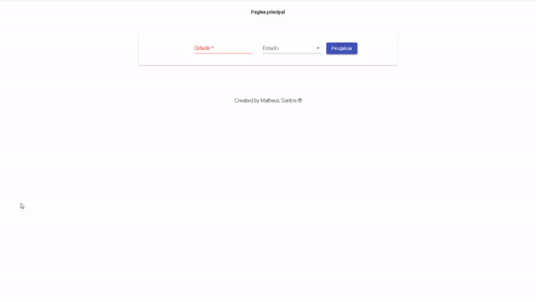

# Weatherapi

This project was generated with [Angular CLI](https://github.com/angular/angular-cli) version 8.3.21.

## Sobre o projeto

Este é um projeto feito com Angular 8, usando a framework de CSS Material. O objetivo é criar um site em que o usuário possar ver a temperatura atual e a previsão do tempo de qualquer cidade brasileira.

## Componentes externos usados
<ul>
    <li>
        Ngx-charts para o gráfico <https://swimlane.gitbook.io/ngx-charts/>
    </li>
    <li>
        Api do HG Brasil usada para receber dados sobre temperaturas em vários locais <https://hgbrasil.com/>
    </li>
<ul>
  
  

